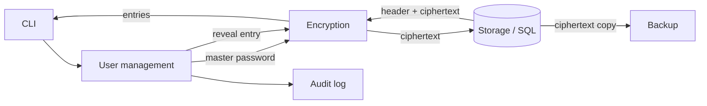
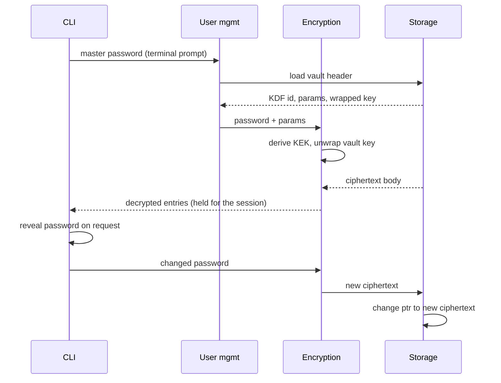

# Secure Password Manager — Core & CLI

GUI document: `web-app-security.md`

## 1. Scope

This app is:
- Desktop native
- Multi-user on single device (though no teams or secret sharing)
- Fully local (no automatic backuping plan yet, only ciphertext export)
- Authenticated with a master password (later maybe with MFA, Google SSO or similar)

## 2. Architecture

The app consists of 6 modules with responsibilities split between them. The goal of this app is to securely store passwords and protect against memory leaks, injection attacks and other cryptographic attacks.

| Module | Responsibility |
| --- | --- |
| CLI | Command parsing, terminal output, one-entry reveal, clipboard |
| User management | Password prompt, KDF params, unlock/lock state, session lifetime |
| Encryption | Encryption/decryption, key derivation, key wrap, nonces, salts; **handles plaintext in memory** |
| Storage | SQL db management, schemas |
| Audit log	| Structured events - logins, unlocks, vault changes |
| Backup | Ciphertext-only export |




### Data Flow



## 3. Design decisions

**Vault format.** Vault is a single db row per user: plaintext header + encrypted body (all passwords), header authenticated as associated data. This way it doesn't leak entry count or existence of specific entry (e.g. existence of github account).

It is also impossible to read other users' entries, as they will not decrypt even if somehow obtained.

Header contains format version, KDF id and params, salt, wrapped vault key, revision counter, body nonce, etc.

Body is a compressed JSON of all entries *(may be changed later)*, padded to 4 KiB, rewritten whole on every save. Per-entry encryption leaks entry count and sizes and multiplies nonce management, wchih gains nothing in performance, since the app is so small.

**Cryptographic scheme:**

A personal vault key exists for every password, personal body key for every entry. Master password (or MFA/SSO) decrypts vault key. Vault key decrypts body key, which deciphers JSON block.

1) Argon2id (m=256 MiB, t=3, p=1) derives a KEK from the master password it was chosen to prevent brute force attacks against encrypted vault;
2) KEK wraps a random 32-byte vault key; the vault key derives a body key via HKDF-SHA-256. AES / ChaCha20 for the wrap and the body. The format is KDF-agnostic and specific algorythm will be decided upon later. Details of this scheme may likely be changed in the future.
3) Master password and body key can be rotated independently.

**Programming language - Rust.** It was chosen because it lets you control memory directly the way C does, but stops whole categories of memory bugs the way Java or Go do. I personally, don't have a lot of experience with Rust, and my assumption is that, long-term, avoiding hand-managing memory will result in safer code, as there will be less opportunities for human error bugs.


## 4. Threat model

### Security Assumptions

- **An attacker has access to encrypted vault db.**
- **An attacker has access to the application source code.**
- **An attacker can use the same device (as a different vault user) and read memory on target device after the vault has been unlocked and used and is locked again.**
- **App user might not have the best password hygiene or be a proficient PC user.**
They might forget to close the session, accidentally copy or display their entire vault, or use an easy password.

### Out of scope - not covered threats:

- **The host device is trusted while unlocked.**
- **The attacker might have a keylogger on target device or do memory snapshots while app is in use.**

### Threat analysis

| Surface | Threat | Mitigation |
| --- | --- | --- |
| Master password | Offline brute force against a stolen vault | Single encrypt/decrypt uses 256 MiB of memory, so brute frocing is not an option |
| Master password | Weak password chosen by the user | Use strength meter, length rules, reject common passwords |
| Vault at rest | File stolen from disk, backup or cloud sync | Whole body encrypted under a random vault key; only the header is readable |
| Vault at rest | Header tampering | Header is authenticated as associated data so altered parameters fail the tag check |
| Vault at rest | Rollback to an older vault to restore a revoked password | Needs to be addressed with tag versioning |
| Vault at rest | Corruption or crash mid-write losing the vault | Write to a temp file, fsync, atomic rename; keep the previous version as a backup |
 |Vault at rest | Malicious crafted input reaching the parser or a query | #![forbid(unsafe_code)] and parameterized SQL; header parser fuzzed |
| Vault in memory | Memory dump or core file of a running process | Vault key in locked pages, zeroed on lock; core dumps disabled |
| Vault in memory | Key paged to swap or a hibernation file | `mlock` the key material and the decrypted entry set, no swap allocations |
| Vault in memory | Session left unattended | Auto-lock on idle timeout, on screen lock, on suspend |
| Vault in memory | Runtime copies of secrets | In Rust, `zeroize`/`secrecy`; no implicit copies of secret types, `#[must_use]` on every AEAD output (so tag failure is not ignored) |
| Access control | One user reading or editing another's records | Every query scoped by session user id |
| Interface | Secrets in shell history / process arguments | Never accept a master password as an argument or env variable; prompt on the terminal with echo disabled |
| Interface | Passwords in terminal scrollback | Passwords are only revealed one at a time on request, so this threat exists, but is minimized |
| Interface | Secrets in redirected output or a piped log | Refuse to write secret fields when stdout is not a TTY (maybe unless an explicit `--raw` flag is passed) |
| Interface | Modified header content received by the terminal | Validate, strip or escape control sequences before printing any stored field or evaluating; |
| Interface | Timing or error msg attacks | One generic unlock failure message and a constant minimum delay |

## 5. Planned commands

Since the app currently doesn't have a name, example name is `vault`.

```
vault init | unlock | lock        # create a vault; start / end session
vault list                        # metadata only, no secrets
vault get <name> [--show|--copy]  # reveal or copy one field, e.g. `vault get github`
vault save <name> <pass>          # Save new password, or replace the old one
vault list                        # Show all existing entries (w/o secrets)
vault rm <name>                   # remove a secret
vault gen [--length 24]           # generate a text password
vault export-cypher <path>        # ciphertext copy
```
as well as others, e.g. to view logs.