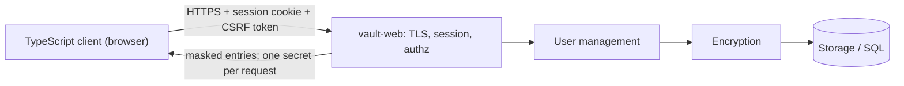

# Web GUI — Architecture & Security

Core document: `secure-password-manager.md`

## 1. Scope

This documents covers everything the HTTP surface introduces: TLS, accounts and login, server-side sessions, CSRF, CSP and per-request authorization.

Everything regarding encryption, storage and other modules in found in `secure-password-manager.md`.

## 2. Architecture

This app consists off:
- The web front end: a Rust HTTP server `vault-web`
- Rust core reused from ICS0022 Secure Programming project
- TypeScript browser client



In addition to main architecture, the `vault-web` module is added, which is responsible for TLS and session management. 
**Typescript** is used for UI only (and network protocols), main vault logic is in **Rust**.

### Data flow

1) `POST /login` verifies the Argon2id password hash, then unwraps that user's vault key.

2) server opens a session, rotates the cookie and issues a CSRF token.

3) `GET /entries` returns metadata for that user only.

4) `POST /entries/{id}/reveal` returns one secret field for that request alone. Every handler resolves the user from the session and hands it to the core's ownership check; no identity is ever read from the request body.

The idle timer is server-side and authoritative: on expiry the key is zeroed and the next request gets a 401. The overview/detail split keeps at most one secret in the browser heap. Session holds a key across requests until session end.

All memory management is done server-side, described in `secure-password-manager.md` §2 & §3.

## 3. Design decisions

Server holds an unwrapped key for the life of a session. Made for convenience, otherwise app is not usable.

- Session credential: server-side session, `HttpOnly` `Secure` `SameSite=Strict` cookie, rotated on login, deleted upon session closure

- CSRF - per-session token on every state-changing request, `SameSite` and origin check

SQL is not in the web layer, all statements parameterized in the core.

## 4. Threat model

Master-password, vault-at-rest and vault-in-memory analysis in `secure-password-manager.md` §4.

### Out of scope

- The browser is treated as semi-trusted - the user's own, but running extensions and other tabs.

### Threat analysis

| Surface | Threat | Mitigation |
| --- | --- | --- |
| Transport, session | Secrets read in transit; cookie stolen, replayed, fixed, or surviving a restart | TLS with HSTS; server-side session, `Secure` cookie created on login and deleted on logout or timeout |
| Session | State-changing request forged by another origin | Per-session CSRF token, origin check |
| Session | Session left unattended | Auto-lock in 5 min, clear browser cache |
| Access control | Request naming another user's record | User resolved from the session only, then the core's ownership check; return 404 |
| Injection | Malicious input reaching a query or rendered as markup | Parameterized statements; validation, no inline scripts |

## 5. Planned pages

```
- Register      account creation, master password strength floor
- Login         generic failure, constant delay, optional TOTP step
- Vault list    metadata only: title, username, URL, tags; search over metadata
- Entry detail  fields masked; per-field Reveal and Copy buttons
- Entry edit    add / edit / delete, password generator inline
- Settings      idle and clipboard timeouts, TOTP enrolment, KDF upgrade, backup export, account management
```

## 6. Build and run
`vault-web` serves the compiled bundle from the same binary. TLS terminates in the server for development, behind a reverse proxy in deployment.
```bash
cd web && npm install && npm run build         # emits the bundle into vault-web/assets
cargo run -p vault-web -- --tls-cert dev.pem   # serves HTTPS, prints the URL once
```
